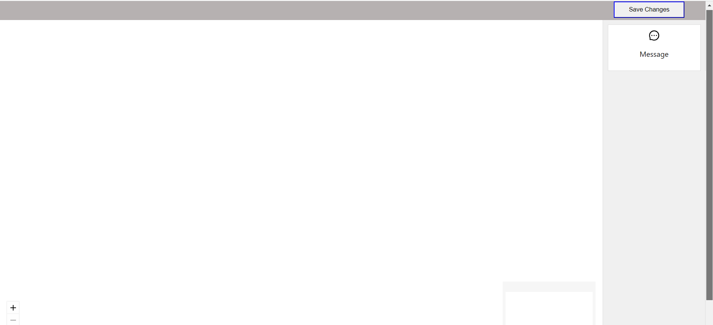
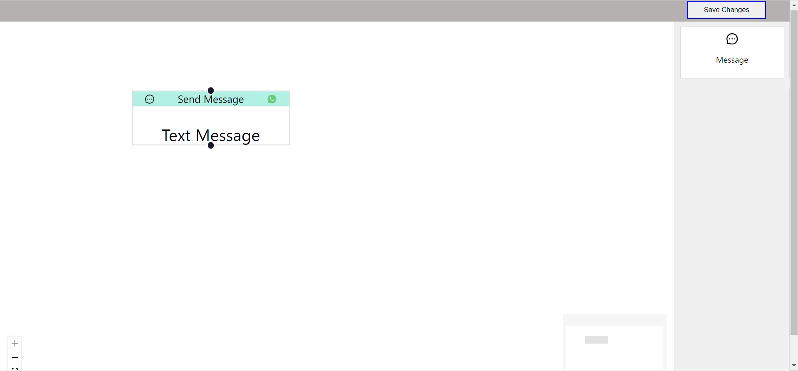
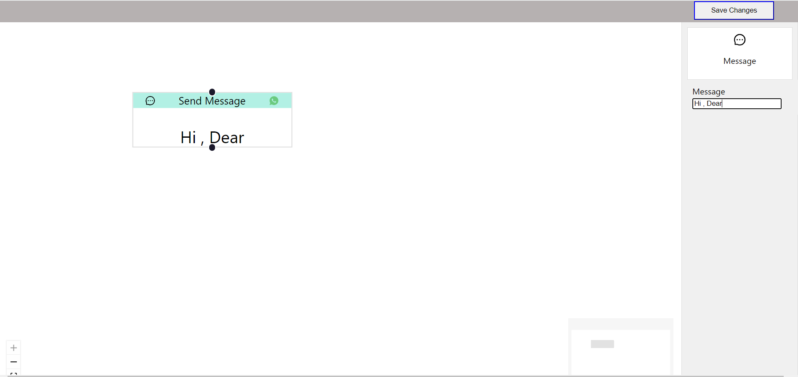
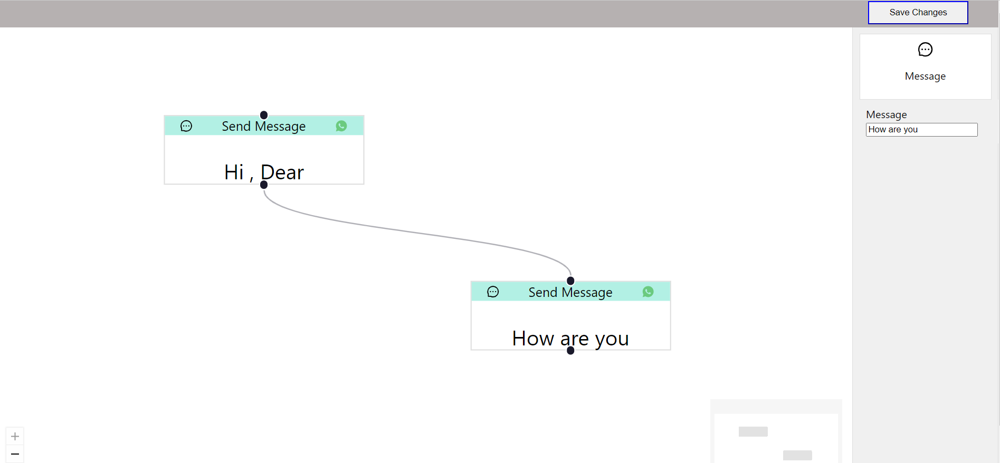
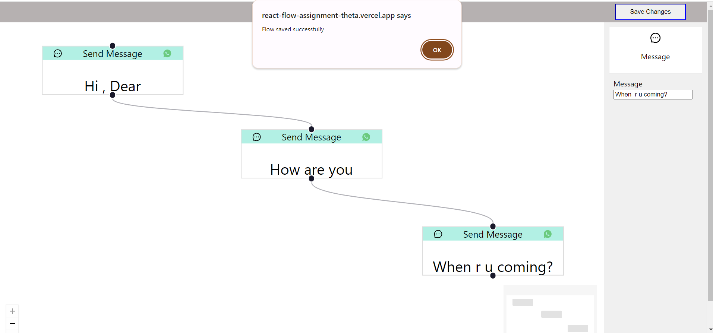
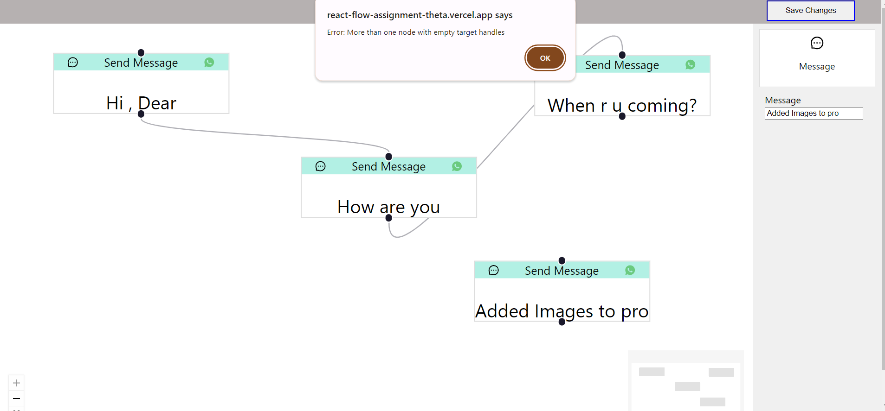
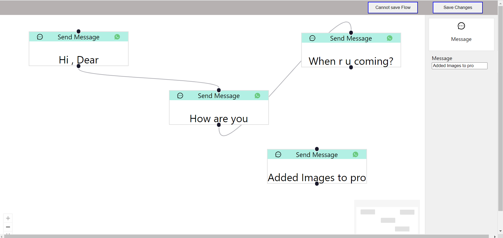

# BiteSpeed Chatbot Flow Builder

## Introduction

This project builds a user-friendly Chatbot flow builder using React and the powerful React Flow library (https://reactflow.dev/). It empowers users to create intricate chatbot conversation flows by visually connecting message nodes, laying the groundwork for adding more node types in the future.

## Project Type

  Frontend

## Deployed App (Placeholder)
 Frontend: https://react-flow-assignment-theta.vercel.app


## Video Walkthrough

[Video](./react-flow-pro.mp4)


## Features

- ### Text Node:
     The initial node type, allowing users to define chatbot messages. Multiple Text Nodes can be incorporated into a single flow.
- ### Extensible Node Panel: 
     Designed to accommodate future node additions, making the Chatbot flow builder versatile.
- ### Edge Connections: 
     Visually represent the conversation flow by connecting nodes with lines.
- ### Source and Target Handles: 
     Maintain connection integrity by ensuring only one outgoing edge originates from a source handle and allowing multiple incoming edges for target handles.
- ### Settings Panel: 
     Contextually replaces the Nodes Panel when a Text Node is selected, offering a text field for editing the message content.
- ### Save Button: 
     Enables users to persist the created chatbot flow. However, the implementation currently prevents saving flows in which all nodes lack target connections (error message displayed).
     
## Design Decisions & Assumptions

- ### Technology Stack: 
    The project primarily relies on React and React Flow for building the interactive flow builder interface.
- ### Future Node Types: 
    The extensible Node Panel facilitates the seamless introduction of new node types (e.g., conditional branching, user input handling) in the future.
- ### Saving Functionality: 
    The save function is designed to prevent saving flows with unconnected nodes to ensure a well-defined conversation flow. Consider implementing further logic for handling potential errors or partial saves.


## Installation & Getting Started

### Prerequisites: 
    Ensure you have Node.js and npm (or yarn) installed on your system.
### Clone the Repository:
```
git clone https://github.com/sarikasingh30/react-flow-assignment.git

```

### Install Dependencies:

```
cd react-flow-assignment
npm install
```

### Start the Development Server:
```
npm start
 (or `yarn start`)

```

This will launch the development server and open the application in your default web browser, typically at http://localhost:3000.


## Usage

### Create a Chatbot Flow:
Drag and drop Text Nodes from the Nodes Panel onto the canvas.
Connect nodes using the source and target handles to define the conversation flow.
Double-click on a Text Node to open the Settings Panel and edit the message content.
### Save the Flow (Optional):
Click the Save Button when you're satisfied with your flow.
The application currently prevents saving flows with unconnected nodes. Ensure your flow has a well-defined structure before saving.



---



---



---



---


---


---




## Technology Stack
<b>React: </b> JavaScript library for building user interfaces.

<b>React Flow: </b> Library providing drag-and-drop functionality for creating the flow builder interface.

<b>Tailwind CSS: </b> Styling Library used for styling the components.

--- 